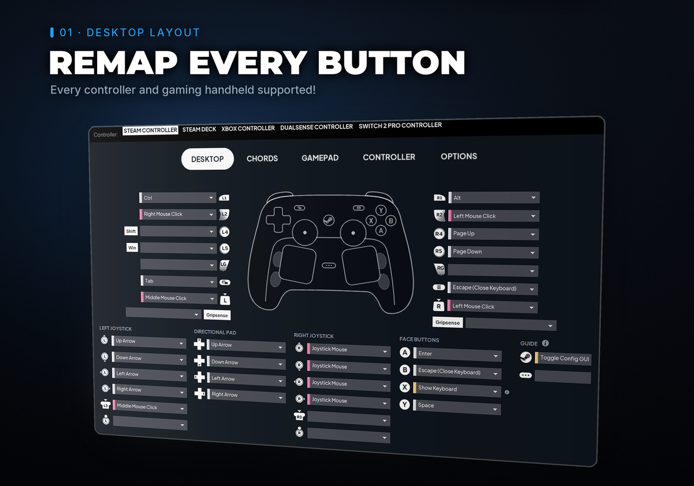

<!--
  Looping hero slideshow. Animated WebP for browsers that take it, animated PNG
  for the rest; both are built by docs/tools/ from real window grabs.
-->

  <picture>
    <source srcset="docs/assets/showcase-slideshow.webp" type="image/webp">
    
  </picture>

# SteamlessInput

An open-source, Steam Input recreation that turns any gamepad into a Steam Controller with improved PC Controls, Virtual Keyboard, Trackpad Gestures, and customizable Virtual Menus for Windows without Steam running! Plus Steam & Big Picture launch options and tools to turn Windows into a console.

SteamlessInput is a platform for building and improving controller features. It fills the gaps Steam Input leaves behind especially around desktop navigation. It's a companion to Steam, not a replacement. Got an idea for something your controller should do? Open an issue and describe it. Code contributions are welcome too.

Some things it's trying to be:

1. Full Steam Input parity.
desktop mouse/keyboard/media bindings, button remapping, and community configs imports via SteamInputDB. Also fixes Steam Input's inability to interact with elevated windows (Task Manager, installers, UAC prompts).

2. A home for experiments.
Adds new features to Steam Controller & DualSense: trackpad gestures (laptop scrolling, pinch to zoom, swipe between pages, text wheel selection, timeline scrubbing), Added gyro typing to the on-screen keyboard — alongside swipe typing, multiple layouts, and custom keyboard skins.

3. Living-room couch gaming.
Turn windows into a console with handy Steam & Big Picture launch options, Sleep Manager, Power Management, display/audio output switching, HDR and Night Light control, media pause and cursor hiding on launch, and a lock-screen keyboard to log into windows.

4. Covers the edge cases Steam Input misses. Translates any controller to a virtual Xbox 360 controller so non-Steam games, launchers, and emulators just work.

---

# Features

**SteamInput parity**

- **Advanced Presses** — long press, double press, soft pull, mode shift
- **Hotkey chords**
- **Community Configs** — import from [SteamInputDB](https://www.steaminputdb.com)
- **Virtual Menus** — streamdeck like folder and layers *(planned)*

## On-screen keyboard

- **Layouts** — QWERTY, phone-style, 75% (F1-F12 and arrow keys), and split
- **Input methods** — trackpad, stick, gyro, mouse
- **Typing modes** — two-thumb simultaneous, swipe, touch, release-touch
- **Gyro typing**
- **Skins** — transparency and size control, including custom anime skins

## Trackpad gestures

*Steam Controller and Steam Deck. PlayStation DualSense planned.*

- Laptop-style smooth scrolling
- Tap to click
- Pinch to zoom
- Swipe between pages
- Text wheel selection
- YouTube timeline scrubbing

## Living-room automation

- Steam and Big Picture launch options, account settings
- Display and audio output device switching
- HDR and Night Light toggles
- Media pause on launch, cursor hiding on launch
- Sleep Manager power settings
- Lock-screen keyboard

## Input Relay

Fixes the inability to interact with elevated windows (Task Manager, installers, UAC prompts).
Steam Input has the same problem. This optional input relay keeps the controller working there.

## Supported controllers

  
  
  
  
  
  
  
  
  
  
  
  
  
  
  
  

---

## Installation

### The easy way — run the setup wizard

Download the release package from the [Releases page](https://github.com/PietPetGit/SteamlessInput/releases), unpack it, and run **`SteamlessInput-Setup`** (`.exe` on Windows).

## Controller keybinds (desktop mode)

These are the defaults — every one of them is rebindable in the GUI.

| Input | Action |
|-------|--------|
|  | Open the on-screen keyboard (or Windows + Ctrl + O) |
|  **(hold)** | Switch between Desktop and Gamepad controls — hold ≡ (Start / Menu / + / Options) **by itself** for about ¾ of a second and a toast tells you which mode you landed in. Works in **both** modes, on every controller, with nothing to bind first. Holding it together with any other button is still a normal chord, and a quick press is still just Start. |
|  +  | Force-shutdown game |
|  +  | Turn off the controller |
|  +  | Alt+Tab — hold Steam to keep the switcher open; each VIEW press advances one slot |
|  +  | Use the trackpad as a mouse while in gamepad mode |
|  +  | Volume up — tap for one step, hold to ramp |
|  +  | Volume down — tap for one step, hold to ramp |
|  +  | Previous song |
|  +  | Next song |
|  | Middle click — click the left stick in (e.g. open a link in a new tab, or close a tab) |
|  +  | Play / pause (click the left stick in) |
|  +  **(while the on-screen keyboard is open)** | Turn on Gyro To Type for the current controller if it's off; if it's already on, recenter the pointer — no keybind needed, see Options → Keyboard → Gyro To Type |

---

## Support the project

If I saved you buying a wireless keyboard, or made your setup better:

- ⭐ **Star the repo.** It's free, and it's the single thing that most helps
  other people find this.
- 💸 **Donate, or leave a tip** I'm a frugal person, so I promise
  no penny goes to waste
- 🛠 **Pay me to add a feature.** Want something big built? DM me or open an issue and we'll talk.

---

## Credits

- Split Keyboard, the hold-for-accents row, the 75% layout with its
  hold-and-drag Select key, Key Hit Assist, Press To Focus Key, per-app
  keyboard memory and the Steam keyboard sounds are merged in from
  [DualTouch](https://github.com/PietPetGit/dualtouch) (LGPL-3.0), a Windows
  fork of this keyboard — see [THIRD_PARTY_NOTICES.md](THIRD_PARTY_NOTICES.md)
- Virtual gamepad driver by [Nefarius/ViGEmBus](https://github.com/nefarius/ViGEmBus)
- Live controller preview ported from [Ramonchi_5's Steam Controller Gamepad Viewer](https://github.com/ramonchi5/Steam-Controller-Gamepad-Viewer-by-Ramonchi_5) (MIT) — see [THIRD_PARTY_NOTICES.md](THIRD_PARTY_NOTICES.md)
- Big Picture automation (Options → Big Picture) builds on three open-source projects, all MIT — see [THIRD_PARTY_NOTICES.md](THIRD_PARTY_NOTICES.md):
  - Night Light control and Big Picture window detection ported from **BigPictureManager** by magrega <!-- TODO: add upstream URL - the local copy carries no repo metadata --> — its byte-level CloudStore registry codec is the reason "Disable Night Light" restores your exact manual/scheduled state instead of blindly toggling
  - Linux controller-connect auto open/close ported from [goatvisuals/Auto-Big-Picture](https://github.com/goatvisuals/Auto-Big-Picture) — `linux/big_picture.py` is essentially its service logic (Steam native/flatpak detection, the `steamapps/common` in-game guard, joystick hotplug polling) moved into the tray process
  - Cursor hiding ported from **Big Picture Portal**'s `cursor.go` (blank system cursors with a move-to-reveal poll) <!-- TODO: add upstream URL - the local copy's README has a placeholder repo path -->

---

## Disclaimer

SteamlessInput is an independent, unofficial project. It is **not affiliated
with, endorsed by, or sponsored by Valve Corporation**. "Steam", "Steam Deck",
"Steam Controller" and "Steam Input" are trademarks of Valve Corporation, used
here only to describe the hardware and software this tool works with.

Some bundled interface artwork originates from the Steam client and remains the
property of Valve Corporation; it is not covered by this project's licence. See
[THIRD_PARTY_NOTICES.md](THIRD_PARTY_NOTICES.md) for full attribution.
