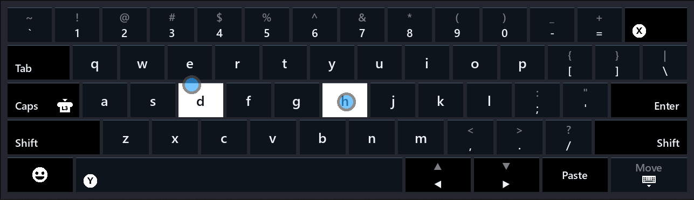
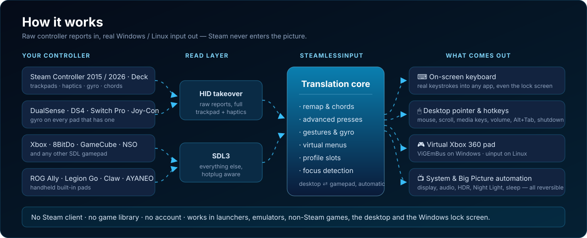
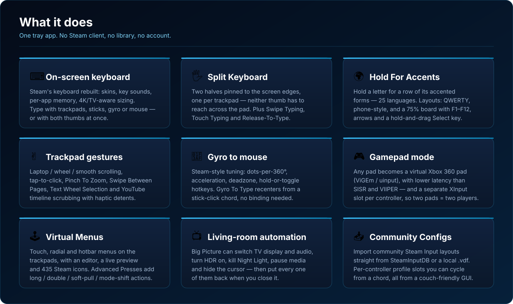
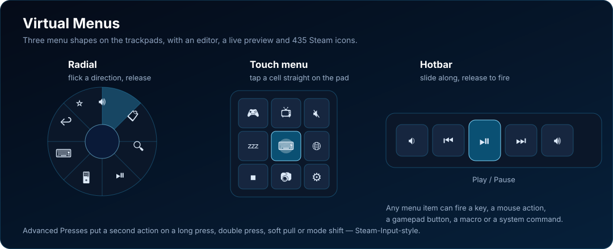
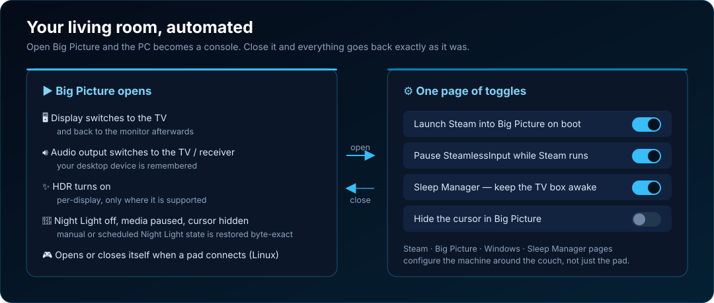
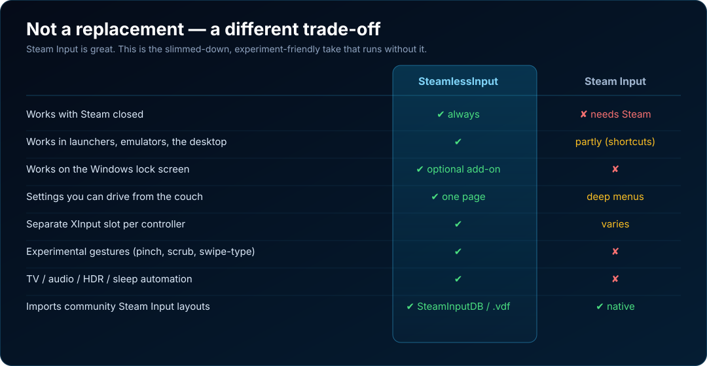
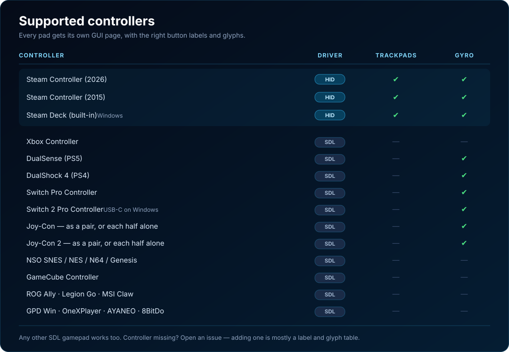
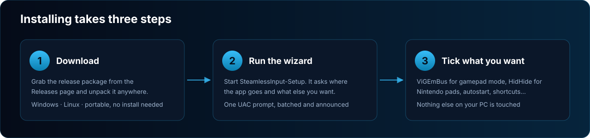

<!--
  GitHub "About" description (paste into the repo sidebar, 350 char limit):

  An open-source, easier-to-use Steam Input that turns any gamepad into a Steam
  Controller — improved PC controls, virtual keyboard, trackpad gestures and
  customisable virtual menus, without Steam running. Plus tools to set up Steam
  and Big Picture for couch-console gaming.

  Suggested topics: steam-input, steam-controller, steam-deck, gamepad,
  on-screen-keyboard, htpc, couch-gaming, controller, windows, linux
-->

<p align="center">
  
</p>

<p align="center">
  <a href="https://github.com/PietPetGit/SteamlessInput/releases"></a>
  <a href="https://github.com/PietPetGit/SteamlessInput/releases"></a>
  <a href="LICENSE"></a>
  
  <a href="../../stargazers"></a>
</p>

# SteamlessInput

**An open-source, easier-to-use Steam Input.** It turns any gamepad into a Steam
Controller — improved PC controls, a virtual keyboard, trackpad gestures and
customisable virtual menus — **without Steam running**. Plus a set of tools to
configure Steam and Big Picture for couch-console gaming.


<sub>Press X to open the on-screen keyboard (or Windows + Ctrl + O)</sub>

---

## What this is

Steam Input is great, and this project does not try to replace it.

SteamlessInput is a **platform for the community to build experimental controller
features on** — the ones Steam can't or won't ship, because they're niche, risky,
or simply not Valve's problem. It's a slimmed-down, easier-to-use take on the
same idea, and it runs as a small tray app with no Steam client, no game library
and no account required.

Three things it's trying to be:

1. **Easier to use.** Steam Input is enormously powerful and enormously fiddly.
   Here the settings sit on one page, in plain words, in a GUI you can drive from
   the couch with the controller itself.
2. **A home for experiments.** Trackpad gestures, gyro typing, swipe typing,
   virtual menus, pinch-to-zoom, timeline scrubbing — features that would never
   survive Valve's support burden get to exist here.
3. **Your living-room setup.** Everything you'd otherwise need a wireless
   keyboard for, done from the pad already in your hands.



## Why you'd want it

- **Finally get rid of your wireless keyboard.** A full on-screen keyboard you
  type on with trackpads, sticks, gyro or a mouse — plus a real desktop pointer,
  media keys, volume, Alt+Tab and shutdown, all on the controller.
- **Living-room / HTPC setup, sorted.** One page of toggles sets Steam to launch
  into Big Picture on boot, and Big Picture automation can switch your TV display
  and audio output, turn HDR on, kill Night Light, pause media and hide the
  cursor — then put every one of them back when you close it.
- **For those edge cases where your controller does nothing outside Steam.**
  Launchers, emulators, non-Steam games, the desktop itself, the Windows lock
  screen. Steam Input only helps inside Steam; this doesn't care.
- **Experimental features for the Steam Controller.** The 2015 pad and the 2026
  one both get a full HID takeover — trackpads, haptics, chords, remapping — with
  features Valve never shipped for them.
- **Lower-latency gamepad emulation** than SISR and VIIPER, and a separate XInput
  player slot per controller, so two pads are two players.

---

## Features



**On-screen keyboard**

- Steam's keyboard, rebuilt: skins, key sounds, per-app memory, 4K/TV-aware sizing
- Type with the trackpads, sticks, gyro or a mouse — or with two thumbs at once
- **Split Keyboard** — two halves pinned to the screen edges, one per trackpad,
  so neither thumb has to reach across the controller
- **Swipe Typing**, **Touch Typing** and **Release Touch To Type** modes
- **Hold For Accents** — hold a letter for a row of its accented forms (25 languages)
- Layouts: classic QWERTY, phone-style, and a **75%** board with F1-F12, arrows
  and a hold-and-drag Select key
- Key Hit Assist and Press To Focus Key for fast, sloppy typing
- Optional **lock-screen keyboard**, so you can sign in to Windows without one



**Desktop control**

- Recreates the Steam Controller's default desktop bindings on every pad
- Trackpad/stick behaviours: mouse, scroll wheel, button pad, mouse region
- **Trackpad gestures** — laptop/wheel/smooth scrolling, tap-to-click,
  **Pinch To Zoom**, **Swipe Between Pages**, **Text Wheel Selection**, and
  YouTube **timeline scrubbing** with haptic detents
- **Gyro to mouse** with Steam-style tuning (dots-per-360°, acceleration,
  deadzone, hold or toggle hotkeys)

**Gamepad mode**

- Translates any pad into a virtual Xbox 360 controller (ViGEm on Windows,
  uinput on Linux)
- Switches between desktop and gamepad control automatically when a game takes
  focus — or hold ≡ (Start/Menu) on its own to flip modes by hand, no binding
  to set up first
- Full remapping, plus keyboard, mouse and system actions on gamepad buttons
- **Advanced Presses** — a second action on a Long Press, Double Press, Soft Pull
  or Mode Shift, Steam-Input-style
- **Virtual Menus** — touch, radial and hotbar menus on the trackpads, with an
  editor, a live preview and 435 Steam icons



**Configuration**

- A controller-navigable GUI: browse and edit everything from the sofa
- **Community Configs** — import community Steam Input layouts straight from
  [SteamInputDB](https://www.steaminputdb.com), or a local `.vdf` file
- Per-controller profile slots you can cycle from a chord
- **Steam**, **Big Picture**, **Windows** and **Sleep Manager** pages that
  configure the machine around the couch, not just the controller



---

## Where it differs from Steam Input



---

## Supported controllers

Every pad below gets its own page in the GUI, with the right button labels and
glyphs. **Steam Controllers and the Steam Deck** are driven by a dedicated HID
takeover (trackpads, haptics, chords, full remap); everything else runs through
SDL3.



<details>
<summary>The same list as a table</summary>

| Controller | Driver | Trackpads | Gyro |
|---|:--:|:--:|:--:|
| Steam Controller (2026) | HID | ✔ | ✔ |
| Steam Controller (2015) | HID | ✔ | ✔ |
| Steam Deck (built-in) | HID *(Windows)* | ✔ | ✔ |
| Xbox Controller | SDL | | |
| DualSense (PS5) | SDL | | ✔ |
| DualShock 4 (PS4) | SDL | | ✔ |
| Switch Pro Controller | SDL | | ✔ |
| Switch 2 Pro Controller | SDL | | ✔ |
| Joy-Con — as a pair, or each half alone | SDL | | ✔ |
| Joy-Con 2 — as a pair, or each half alone | SDL | | ✔ |
| NSO SNES / NES / N64 / Genesis | SDL | | |
| GameCube Controller | SDL | | |
| ROG Ally · Legion Go · MSI Claw | SDL | | |
| GPD Win · OneXPlayer · AYANEO | SDL | | |
| 8BitDo controllers | SDL | | |
| Any other SDL gamepad | SDL | | |

</details>

A few notes: on Linux the Steam Deck currently runs as an SDL pad (the takeover
runtime is Windows-only so far). Switch 2 pads speak a proprietary Bluetooth
protocol no PC stack supports, so on Windows they are USB-C only. Nintendo pads
need [HidHide](#optional-nintendo-switch-pro-controller-in-gamepad-mode-windows-only)
for gamepad mode — the setup wizard configures it for you.

Controller missing? [Open an issue](../../issues) — adding one is mostly a label
and glyph table.

---

## Installation



### The easy way — run the setup wizard

Download the release package from the [Releases page](https://github.com/PietPetGit/SteamlessInput/releases), unpack it, and run **`SteamlessInput-Setup`** (`.exe` on Windows).

It asks where the app should go, then shows you every optional piece with a plain description and whether your PC already has it — you tick what you want and nothing else is touched:

| Component | Windows | Linux |
|---|---|---|
| **SteamlessInput** (required) | ✔ | ✔ |
| Start Menu / application-menu entry | ✔ | ✔ |
| Desktop shortcut | ✔ | |
| Start with Windows / at login | ✔ | ✔ |
| **ViGEmBus driver** — needed for gamepad mode | ✔ | not needed (uinput is in the kernel) |
| **HidHide** — Switch Pro phantom-input fix | ✔ | not needed |
| **Hide the Nintendo controller** — the HidHide side, set up for you | ✔ | not needed |
| **Input relay** — controller keeps working over admin windows | ✔ | not needed |
| **Lock-screen keyboard** — ⚠ security trade-off, off by default | ✔ (separate download, see below) | |
| **Tray libraries** — GTK3 / AppIndicator / XWayland | | ✔ |
| **udev rules** — controller access without root | | ✔ |
| **uinput rule** — kernel-level input, needed under Wayland | | ✔ |

Anything needing administrator/root is marked and batched, so you get **one** UAC prompt (or one `pkexec` password prompt) at a point where the wizard has already told you it's coming. The lock-screen keyboard additionally makes you read its warning and tick "I understand" before it can be selected.

The wizard registers an entry in **Apps & features** (Windows), so you can undo everything later — or run `SteamlessInput-Setup --uninstall` and pick what to remove.

<details>
<summary>Scripted / headless install</summary>

Both wizards take the same flags:

```
SteamlessInput-Setup --list                                  # component keys
SteamlessInput-Setup --console                               # text-mode wizard
SteamlessInput-Setup --console --yes                         # accept defaults
SteamlessInput-Setup --console --with app,autostart,vigem --dir "D:\Apps\SI"
SteamlessInput-Setup --uninstall --console --yes
```

`--yes` never selects the lock-screen keyboard; opting into it always takes an explicit `--with lockscreen`.

**On Windows, use `SteamlessInput-Setup.cmd` (same arguments) if you want to capture the output.** The `.exe` is a GUI-subsystem program and PowerShell's `>` doesn't capture those, so redirecting it directly gives you an empty file. The `.cmd` is a one-line shim that fixes it; pipes and `cmd.exe` redirection work with either.
</details>

### The manual way — portable, no installer

SteamlessInput is a single self-contained binary and stays portable; the wizard only exists to automate the surrounding setup. If you'd rather do it yourself:

1. **Windows** — unzip `SteamlessInput-windows.zip` anywhere and run `SteamlessInput-windows.exe`. Keep the unzipped folder together: the exe needs the `_internal\` folder beside it. For gamepad mode, install the [ViGEmBus driver](https://github.com/nefarius/ViGEmBus/releases) once; without it the keyboard and desktop control still work.

2. **Linux** — the binary needs the GTK3 / AppIndicator tray libraries (not bundled):

   ```bash
   # Fedora
   sudo dnf install gtk3 gobject-introspection libnotify libayatana-appindicator-gtk3

   # Debian / Ubuntu
   sudo apt install gir1.2-gtk-3.0 gobject-introspection libnotify4 gir1.2-ayatanaappindicator3-0.1

   # Arch
   sudo pacman -S gtk3 gobject-introspection libnotify libayatana-appindicator
   ```

   Then make it executable and run it:

   ```bash
   chmod +x SteamlessInput
   ./SteamlessInput
   ```

   On Wayland (e.g. Plasma 6) the app routes input through XWayland, so make sure `xorg-x11-server-Xwayland` (Fedora) / `xwayland` is installed too. If the app reports no controller found, you also need a udev rule granting access to the pad — the wizard writes one, or see `linux/installer.py` for the rule text.

### Configure settings

Right-click the  tray icon and choose **Keybinds** for the full GUI, or use the menu for the common toggles:

| | |
|--------|-------------|
| **Startup → Start with Windows** | Auto-launch on boot |
| **Startup → When Steam Is Running → Pause** | Pause the listener while Steam is active |
| **Startup → When Steam Is Running → Exit** | Fully exit the app when Steam starts |
| **Gamepad Mode → Auto enable** | Activate gamepad mode automatically when a game is in the foreground |
| **Gamepad Mode → Always enable** | Keep gamepad mode on at all times |
| **Gamepad Mode → Off** | Disable the virtual gamepad entirely |
| **Keyboard Skin → Size / Transparent / theme** | On-screen keyboard look |

Everything else — per-controller settings, gestures, gyro, virtual menus, Steam
and Big Picture automation, sleep management — lives in the **Keybinds** GUI.

## Optional: Lock-screen keyboard (Windows only)

An optional add-on lets you use the controller as a keyboard on the Windows
**lock screen**, so you can type your password and sign in without a physical
keyboard. It is **not** part of core SteamlessInput and carries a real security
trade-off — read
[windows/lockscreen-keyboard/README.md](windows/lockscreen-keyboard/README.md)
before installing.

Because it is 44 MB and most people should decline it, it is **not** in the main
download. Grab **`SteamlessInput-lockscreen-addon.zip`** from the
[Releases page](https://github.com/PietPetGit/SteamlessInput/releases) and unzip
it next to `SteamlessInput-Setup.exe` — the wizard then offers it as a component
(off by default, behind an "I understand" confirmation) and can remove it again.
The `install.bat` inside that zip does the same thing standalone.

## Optional: Nintendo Switch Pro Controller in gamepad mode (Windows only)

**Only for Nintendo pads, to get gamepad mode working.** The Switch Pro (and the Joy-Cons, and the NSO pads) keep spamming phantom input (buttons 1–8) into games even while SteamlessInput is feeding a clean virtual Xbox pad. No program can hide a controller from other programs, so the fix is the **HidHide** driver.

**The setup wizard does all of it for you** — tick **HidHide** and **Hide the Nintendo controller from games**, and it installs the driver, puts SteamlessInput on HidHide's allow-list, hides your Nintendo pad and switches device hiding on. Nothing to click in HidHide Configuration Client.

A driver that was *just* installed only comes alive after a restart, so on a fresh install the wizard schedules the configuration to finish itself the next time you sign in.

Paired a new controller afterwards? Run the setup exe once more:

```powershell
SteamlessInput-Setup.exe --hidhide        # add the new pad, needs administrator
```

Games then see only the virtual Xbox pad, while SteamlessInput still reads the real one. To undo it, run `SteamlessInput-Setup.exe --uninstall` and tick **Hiding of the Nintendo controller** — that un-hides exactly what the wizard hid and leaves anything else using HidHide (DS4Windows, reWASD…) alone.

---

## Controller keybinds (desktop mode)

These are the defaults — every one of them is rebindable in the GUI. There is a
[one-page cheat sheet](docs/assets/cheatsheet.svg) too, if you want something to
keep next to the couch.

| Input | Action |
|-------|--------|
|  | Open the on-screen keyboard (or Windows + Ctrl + O) |
|  **(hold)** | Switch between Desktop and Gamepad controls — hold ≡ (Start / Menu / + / Options) **by itself** for about ¾ of a second and a toast tells you which mode you landed in. Works in **both** modes, on every controller, with nothing to bind first. Holding it together with any other button is still a normal chord, and a quick press is still just Start. |
|  +  | Force-shutdown game |
|  +  | Turn off the controller |
|  +  | Alt+Tab — hold Steam to keep the switcher open; each VIEW press advances one slot |
|  +  | Use the trackpad as a mouse while in gamepad mode |
|  +  | Volume up — tap for one step, hold to ramp |
|  +  | Volume down — tap for one step, hold to ramp |
|  +  | Previous song |
|  +  | Next song |
|  | Middle click — click the left stick in (e.g. open a link in a new tab, or close a tab) |
|  +  | Play / pause (click the left stick in) |
|  +  **(while the on-screen keyboard is open)** | Turn on Gyro To Type for the current controller if it's off; if it's already on, recenter the pointer — no keybind needed, see Options → Keyboard → Gyro To Type |

---

## Support the project

This is a one-person, unpaid project that already tries to do a lot at once. If
it saved you buying a wireless keyboard, or made your living-room PC usable:

- ⭐ **Star the repo.** It's free, and it's the single thing that most helps
  other people find this.
- 💸 **Donate, or leave a tip** if you use it. I'm a frugal person, so I promise
  no penny goes to waste — it goes into hardware to test against and time to
  keep building.
- 🛠 **Pay me to add a feature.** Want something specific built, or your
  controller supported? Sponsor it and I'll prioritise it — open an issue
  describing what you want and we'll talk.

<!-- TODO: replace these with your real donation links before publishing -->
[**Donate / tip**](https://ko-fi.com/YOUR-USERNAME) · [**Sponsor**](https://github.com/sponsors/YOUR-USERNAME)

## Help wanted — bring ideas

The point of this project is to be a **place to try controller ideas Steam
wouldn't ship**. If you've ever thought *"my controller should be able to do X on
the desktop"*, this is where X gets built.

I'm especially looking for people with **creative ideas** — you don't have to
write any code. Open an issue and describe it:

- New trackpad, gyro or motion gestures
- Ways to make couch PC use less painful
- Support for a controller that isn't in the list above
- Anything Steam Input can't or won't do

Code contributions are welcome too. The project is GPL-3.0 and carries a Windows
tree and a Linux tree that stay in step with each other; see
[RELEASE.md](RELEASE.md) for the build and release steps, and
[docs/SHOWCASE.md](docs/SHOWCASE.md) for the graphics used on this page (they are
plain SVG — editing the text in one is a one-line change).

---

## Licence

SteamlessInput is free software under the **GNU General Public License v3.0** —
see [LICENSE](LICENSE).

You may use, study, share and modify it. If you distribute it, modified or not,
you must pass on the same freedoms: ship the source (or a written offer for it)
and keep it under GPL-3.0. You may charge for it — GPL is about freedom, not
price — but you cannot make it closed-source.

Bundled and derived third-party work, and Valve artwork that is **not** covered
by this licence, are listed in [THIRD_PARTY_NOTICES.md](THIRD_PARTY_NOTICES.md).

---

## Credits

- Forked from [archshift/adusk](https://github.com/archshift/adusk) (LGPL-3.0) —
  the on-screen keyboard's origin, since largely reimplemented; see
  [THIRD_PARTY_NOTICES.md](THIRD_PARTY_NOTICES.md)
- Split Keyboard, the hold-for-accents row, the 75% layout with its
  hold-and-drag Select key, Key Hit Assist, Press To Focus Key, per-app
  keyboard memory and the Steam keyboard sounds are merged in from
  [DualTouch](https://github.com/PietPetGit/dualtouch) (LGPL-3.0), a Windows
  fork of this keyboard — see [THIRD_PARTY_NOTICES.md](THIRD_PARTY_NOTICES.md)
- Gamepad translation inspired by [ddeverill/SteamlessController](https://github.com/ddeverill/SteamlessController)
- Virtual gamepad driver by [Nefarius/ViGEmBus](https://github.com/nefarius/ViGEmBus)
- Rumble implementation adapted from [CrazyCritic89/SteamHapticsSinger](https://github.com/CrazyCritic89/SteamHapticsSinger)
- Battery-status parsing referenced from the `sc2-research` HID protocol notes (MIT) <!-- TODO: add upstream URL - the local copy carries no repo metadata -->
- Live controller preview ported from [Ramonchi_5's Steam Controller Gamepad Viewer](https://github.com/ramonchi5/Steam-Controller-Gamepad-Viewer-by-Ramonchi_5) (MIT) — see [THIRD_PARTY_NOTICES.md](THIRD_PARTY_NOTICES.md)
- Big Picture automation (Options → Big Picture) builds on three open-source projects, all MIT — see [THIRD_PARTY_NOTICES.md](THIRD_PARTY_NOTICES.md):
  - Night Light control and Big Picture window detection ported from **BigPictureManager** by magrega <!-- TODO: add upstream URL - the local copy carries no repo metadata --> — its byte-level CloudStore registry codec is the reason "Disable Night Light" restores your exact manual/scheduled state instead of blindly toggling
  - Linux controller-connect auto open/close ported from [goatvisuals/Auto-Big-Picture](https://github.com/goatvisuals/Auto-Big-Picture) — `linux/big_picture.py` is essentially its service logic (Steam native/flatpak detection, the `steamapps/common` in-game guard, joystick hotplug polling) moved into the tray process
  - Cursor hiding ported from **Big Picture Portal**'s `cursor.go` (blank system cursors with a move-to-reveal poll) <!-- TODO: add upstream URL - the local copy's README has a placeholder repo path -->

---

## Disclaimer

SteamlessInput is an independent, unofficial project. It is **not affiliated
with, endorsed by, or sponsored by Valve Corporation**. "Steam", "Steam Deck",
"Steam Controller" and "Steam Input" are trademarks of Valve Corporation, used
here only to describe the hardware and software this tool works with.

Some bundled interface artwork originates from the Steam client and remains the
property of Valve Corporation; it is not covered by this project's licence. See
[THIRD_PARTY_NOTICES.md](THIRD_PARTY_NOTICES.md) for full attribution.

The Windows executable is **not code-signed**, so SmartScreen will likely warn
on first run ("Windows protected your PC" → *More info* → *Run anyway*). This is
expected for an unsigned independent release, not a sign of malware — build it
yourself from source if you would rather not trust the binary.
