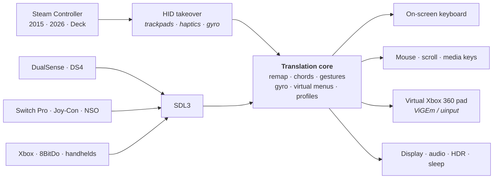
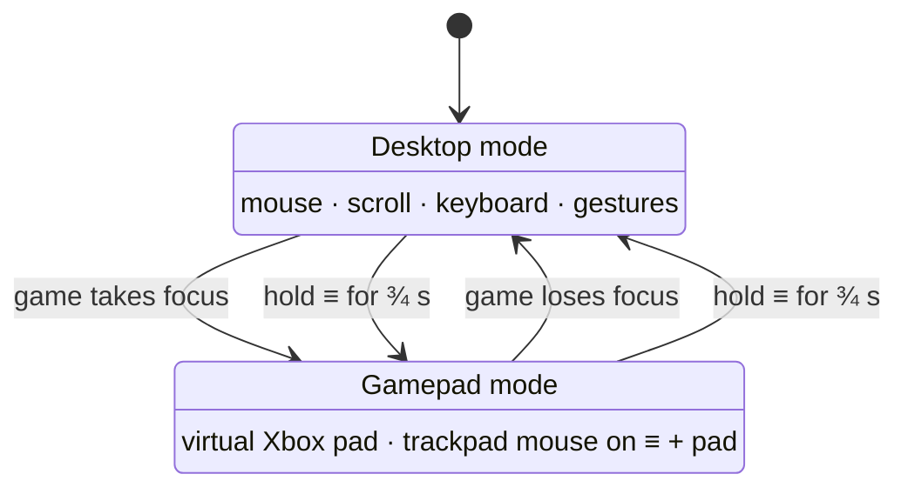
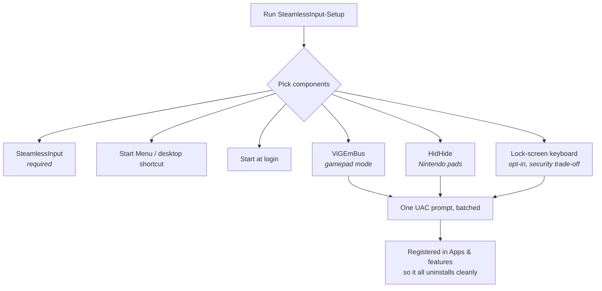
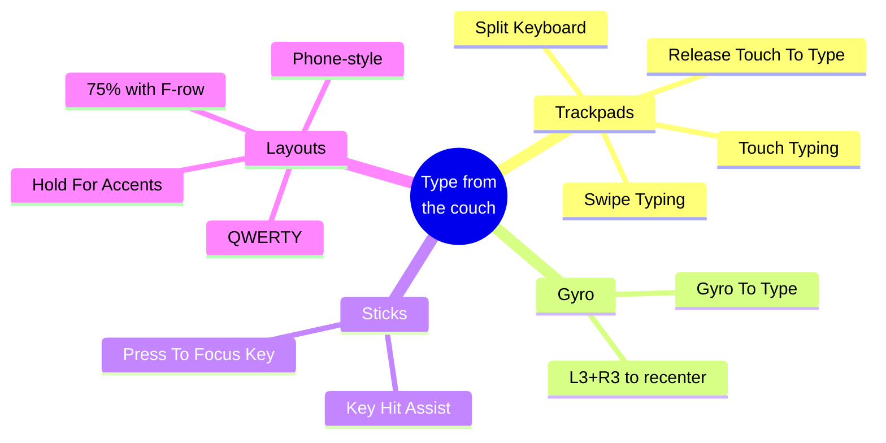

# Showcase assets

Every graphic here is a hand-written, self-contained SVG in [`docs/assets/`](assets/).
They use no external fonts, scripts or images, so they render inline on GitHub,
scale to any width, and stay sharp on a 4K monitor. Nothing needs a build step —
edit the text in a file and the graphic is updated.

| File | Size | Use it for |
|---|---|---|
| [`hero.svg`](assets/hero.svg) | 1280×420 | Top of the README |
| [`features.svg`](assets/features.svg) | 1280×760 | "Features" section |
| [`how-it-works.svg`](assets/how-it-works.svg) | 1280×520 | "What this is" / architecture |
| [`keyboard-modes.svg`](assets/keyboard-modes.svg) | 1280×520 | On-screen keyboard section |
| [`controllers.svg`](assets/controllers.svg) | 1080×748 | "Supported controllers" |
| [`comparison.svg`](assets/comparison.svg) | 1080×560 | "Not a replacement" pitch |
| [`virtual-menus.svg`](assets/virtual-menus.svg) | 1080×440 | Gamepad-mode section |
| [`big-picture.svg`](assets/big-picture.svg) | 1080×460 | Living-room / HTPC section |
| [`cheatsheet.svg`](assets/cheatsheet.svg) | 880×620 | Default keybinds |
| [`install.svg`](assets/install.svg) | 1280×300 | Installation section |
| [`logo.svg`](assets/logo.svg) | 256×256 | Icon, docs, avatars |
| [`social-preview.png`](assets/social-preview.png) | 1280×640 | GitHub **social preview** (Settings → General → Social preview) |

Three of them animate subtly on GitHub (the hero logo drifts, the swipe-typing
trace draws itself, the radial menu sweeps). They degrade to a clean static
image anywhere animation is disabled.

---

## Copy-paste blocks

### Hero (top of the README)

```markdown
<p align="center">
  
</p>
```

### Badge row

```markdown
<p align="center">
  <a href="https://github.com/PietPetGit/SteamlessInput/releases"></a>
  <a href="https://github.com/PietPetGit/SteamlessInput/releases"></a>
  <a href="LICENSE"></a>
  
  <a href="../../stargazers"></a>
</p>
```

### Section images

```markdown


```

### Light/dark variants

If you ever add a light-theme version of an asset, GitHub picks between them
with `<picture>`:

```markdown
<picture>
  <source media="(prefers-color-scheme: dark)"  srcset="docs/assets/hero.svg">
  <source media="(prefers-color-scheme: light)" srcset="docs/assets/hero-light.svg">
  
</picture>
```

The current set is dark-on-dark by design and paints its own background, so it
reads correctly in both GitHub themes as-is.

---

## Diagrams you can paste anywhere

GitHub renders these Mermaid blocks natively — in the README, in issues, in
discussions and in release notes.

### Input pipeline



### Desktop ⇄ gamepad mode



### What the setup wizard installs



### Typing paths



---

## Regenerating the raster

`social-preview.png` is rendered from `social-preview.svg`. Any headless Chromium
does it:

```powershell
& "C:\Program Files (x86)\Microsoft\Edge\Application\msedge.exe" `
  --headless --disable-gpu --hide-scrollbars --window-size=1280,640 `
  --screenshot="docs\assets\social-preview.png" `
  "file:///$PWD/docs/assets/social-preview.svg".Replace('\','/')
```

---

## Editing tips

- Colours live in the `<defs>` of each file. The palette is
  `#050B18` (ink), `#0B1729`/`#12233F` (cards), `#0A7FB0` (brand),
  `#38BDF8` (accent), `#DCE9F8` (text), `#8FA3BF` (muted).
- Text is real `<text>`, not paths, so it stays searchable and easy to retype —
  but it is not auto-wrapped: each line is its own `<text>` element.
- Fonts fall back to the viewer's system UI font, so keep a little slack at the
  end of long lines.
